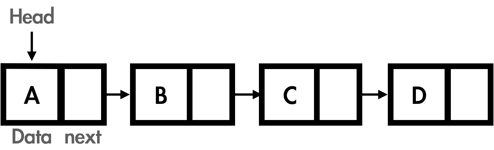

## Array vs LinkedList
---
### Array (배열)

* 특징
  - 데이터를 연속적인 메모리 위치에 저장한다.
  - 연속적인 위치 덕분에 요소에 대한 접근이 용이하다.
* 크기
  - 한번 정의되면 배열의 크기를 늘릴 수 없다.
* 메모리
  - 컴파일 할때 메모리가 할당된다.
  - 동적 배열은 런타임에 메모리가 할당된다.
* 처리 속도
  - 어떤 요소든 한번에 접근이 가능하다. O(1)
  - 더 좋은 cache locality를 가진다.
  - 삽입과 삭제는 해당하는 요소의 뒷 요소들의 이동이 필요하기 때문에 O(n)의 복잡도가 발생한다.

### Linked List

* 특징
  - 메모리 위치가 붙어서 저장되지 않을 수 있다.
  - 연속적으로 저장되지 않는 대신 다음 요소에 대한 정보가 같이 저장된다.
* 크기
  - 각 노드가 다음 노드를 가리키고, 흩어져 저장될수 있기에 동적인 크기를 가질 수 있다.
* 메모리
  - 런타임에 메모리가 할당된다.
  - 같은 데이터를 저장할 때, 메모리는 배열에 비해 많이 차지한다.  
  (다음 노드 정보도 저장해야하기 때문에)
  - 데이터 사이즈의 변화가 있을 경우에는 효율적이다.  
  (배열이 데이터 사이즈만큼의 메모리를 할당해야하는 동안 링크드 리스트는 크기를 늘리면 되기 때문에)
* 처리속도
  - 어떤 요소에 접근하려면 해당 요소가 위치한 곳까지 찾는 시간이 필요하다. O(n)
  - 삽입/삭제는 배열에 비해 빠르다. O(1)

### 언제 무엇을 사용해야할까?
- 인덱스가 중요한 경우, 데이터 접근이나 수정이 잦은 경우 배열을 사용한다
- 데이터 사이즈가 바뀔 가능성이 있고, 삭제/삽입이 많은 경우 링크드리스트를 사용한다.