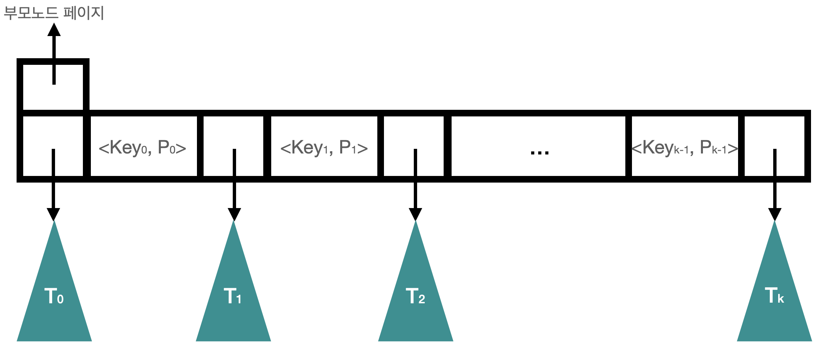
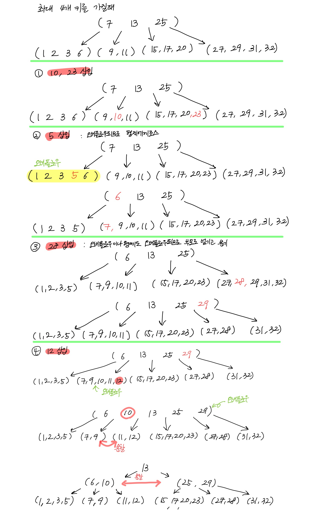
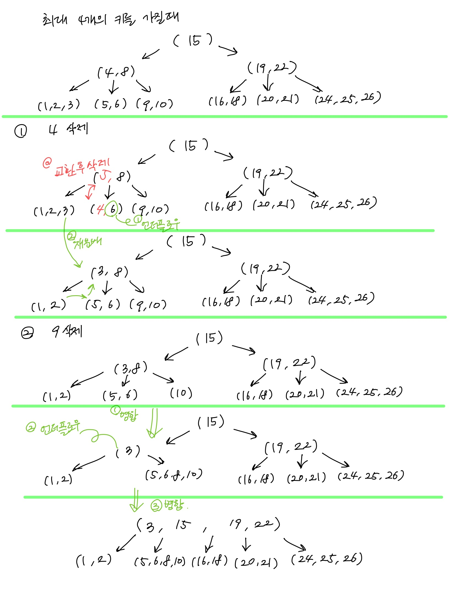

# B Tree & B+ Tree
* 디스크 환경에서 사용하기 적합한 외부 다진 검색 트리
  - 외부 검색 트리: 검색트리가 디스크에 있는 상태
  - 다진 검색 트리: 분기의 수가 2개를 넘는 상태 (자식노드의 수가 2개 이상)  
 
### 이진검색트리 특징과 다진검색트리 특징
* 이진검색트리의 특징
  - 모든 원소는 서로 다른 유일키를 가짐
  - 왼쪽 서브트리에 있는 원소의 키는 루트의 키보다 작음
  - 오른쪽 서브트리에 있는 원소의 키는 루트의 키보다 큼
  - 왼쪽 서브트리와 오른쪽 서브트리도 모두 이진탐색트리
* 다진검색트리의 특징
  - 각 노드는 0~m개의 서브트리를 가짐
  - k개의 서브노드를 가지는 노드는 (k-1)개의 자료를 가짐
  - 각 노드 안에서 자료들은 검색키에 의해 정렬  
    : Key1 <= Key2 <= ... <= Key(k-1)
  - Key i <= i번째 서브트리 내의 모든 키 값 < Key(i+1)을 항상 만족
  - 모든 서브트리는 다진검색트리

## B Tree
* 조건  
  1) 2개 이상의 서브트리를 가짐
  2) 루트를 제외한 모든 노드는 k/2 ~ k개의 서브트리를 가짐
  3) 모든 리프는 같은 높이를 유지 (완전균형)
  

* B트리에서 검색
  - B트리에서 최대 k개의 키를 갖는다.
  - x를 검색할 때, 노드의 여러 키 중 일치하는 것 있는지 확인
  - keyi-1 < x < keyi인 두키를 찾아 분기할 자식을 찾기
  - 자식으로 분기하면 깊이하나만 내려가서 똑같이 재귀로 처리
  
* B트리에서 삽입
  1) x를 삽입할 리프노드 r을 찾음
  2) 노드 r에 여유 공간이 있으면 키 삽입
  3) 노드 r에 여유 공간이 없으면 형제노드를 보고, 형제노드에 여유가 있으면 키 하나를 넘김
  4) 형제노드에 여유가 없으면, 가운데 키를 부모노드로 넘기고 노드를 두개로 분리  

 

* B트리에서 삭제
  1) x를 키로 갖고 있는 노드를 찾음
  2) 이 노드가 리프노드가 아니면 x의 직후 원소 y를 가진 리프노드 r을 찾아 x와 y를 맞바꿈
  3) 리프노드에서 x를 제거
  4) x제거하고 노드에 언더플로가 발생하면 적절히 해소  
  
 

* B트리 성능
  - 높이: logd/2(N) ~ logd(N)
  - 검색: O(logN)
  - 삽입: O(logN) (+오버플로 처리하는데 높이만큼의 시간)
  - 삭제: O(logN) (+언더플로 처리하는데 높이만큼의 시간)
  
* B트리 활용
  : DBMS, FS의 인덱스 자료구조로 사용됨, 성능이 일정하면서 빠른 탐색이 요구되는 경우 사용

## B Tree+
* 특징
  - 데이터가 리프노드에 저장됨
  - 리프 노드들끼리 링크드 리스트로 연결됨
  - key 범위마다 찾는 페이지 넘버가 있어서 바로 범위 찾기 가능
  - leaf 노드는 서로 연결되어 있어서 임의 접근이나 순차 접근 모두 성능이 우수

 

|구분|B-tree|B+tree|
|---|------|------|
|데이터 저장|모든 노드에 데이터 저장|리프 노드에만 데이터 저장|
|트리의 높이|높음|낮음|
|검색|모든 노드 탐색|리프 노드에서 선형 탐색| 
|키 중복|없음|있음(리프 노드에 모든 데이터가 있기 때문)|
|검색|루트와 가까운 경우 브랜치 노드에도 데이터가 존재하기 때문에 빠름|리프 노드까지 가야 데이터 존재|
|링크드 리스트|없음|리프 노드끼리 링크드 리스트로 연결|