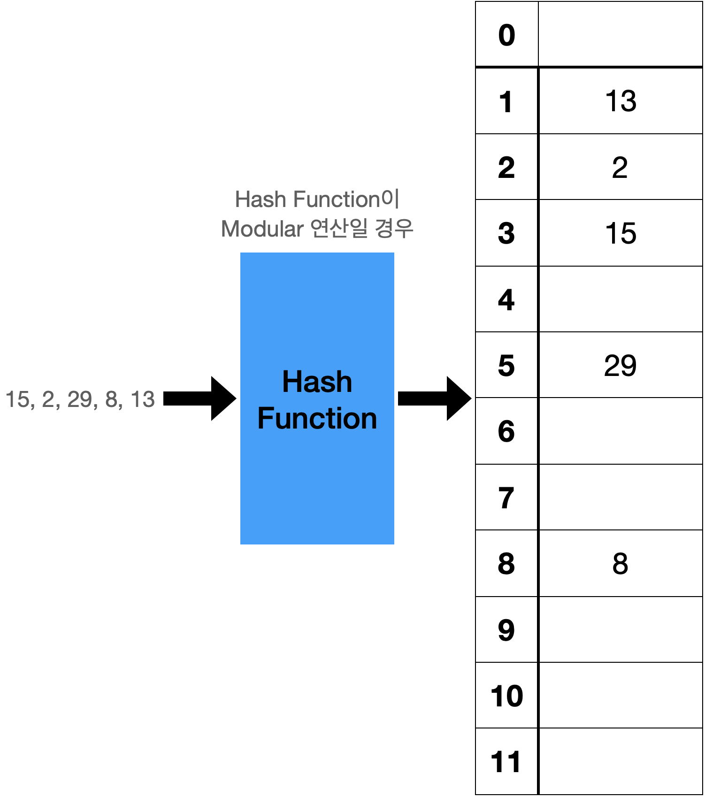

# Hash

### 해시 함수  
- 해시 함수는 키 값을 입력으로 받아 해시 테이블상의 주소를 리턴한다.  
- 해시함수의 성질  
    - 입력 원소가 해시테이블 전체에 고루 저장되어야 한다.  
    - 계산이 간단해야한다.  
  

**해시함수를 만드는 대표적인 방법**  
- 나누기 방법  
    m은 해시테이블의 크기로 0~m-1주소값을 가지므로 m으로 나눈 나머지 연산하여 해시값을 알아낸다.  
    *h(x) = x mod m*
- 곱하기 방법  
    입력 값을 0과 1사이의 소수로 대응시킨 후, 해시테이블 크기 m을 곱하여 0~m-1 사이로 팽창시킨다.  
    x에 소수 A를 곱한 후 소수부만 취한다. 해당 소수부에 m을 곱하여 정수부를 취한다.
    *h(x) = m(xA mod 1)*

### 해시 테이블
- 저장된 자료를 비교하여 찾는 것이 아닌, 단한번의 계산으로 자신의 자리를 찾음  
  
주소를 한번에 계산할수 있지만, 위의 그림과 같은 경우에 5가 새로 들어오는 경우 충돌이 일어난다.

---

## 충돌 해결  

### 체이닝
* 같은 주소로 해싱되는 원소를 모두 하나의 연결리스트에 매달아서 관리  
* 해시 테이블의 크기가 m이면 최대 m개의 연결리스트가 존재할 수 있다.  
  

### 개방주소 방법
- 체이닝 같은 추가공간을 허용하지 않는다.
- 해시값을 계산하여 계산된 주소를 이미 차지하는 경우, 즉 충돌이 일어날 경우 규칙에 따라 다음 자리를 찾는다.
- 해시함수 1번으로 충돌이 나면 충돌이 나지 않는 n번째 함수까지 계산하는 것  
  
**주소값을 정하는 방법**  
* 선형조사
  - 충돌이 일어난 바로 뒷자리를 보는 방법  
  *h(x) = (h(x) + i) mod m*
  - 특정 영역에 원소가 몰리는 경우, 치명적으로 성능이 떨어진다.  
  
* 이차원조사  
  - 바로 뒷자리를 보는 대신, 보폭을 이차함수로 넓혀가면서 본다.  
  *h(x) = (h(x) + ci^2 + ci) mod m*
  - 점점 보폭이 넓어지지만 최초의 해시값이 같은 원소는 이득을 보지 못한다.

* 더블해싱
  - 두개의 함수를 사용한다.  
  *h(x) = (h(x) + i・f(x)) mod m*
  - f와 h는 서로 다른 함수로, 충돌이 생겨서 다음 주소를 계산할 때 두번째 해시함수 값만큼씩 점프  
  - 권장 함수  
    *h(x) = x mod m*  
    *f(x) = 1 + (x mod m')*  --> f(x) 해시값이 테이블 크기 m과 서로소여야한다.

### 시간복잡도
* 해시테이블 저장소의 길이를 'n', 키의 수를 'm'이라고 할 때, 저장소 1개의 해시당 m/n개의 키가 들어있다.  
  적재율 ⍺ = m/n  
* chaining 시간복잡도: (1+⍺)/2 + ⍺/2n
* 개방주소 방법 시간복잡도: 1 / (1-⍺)