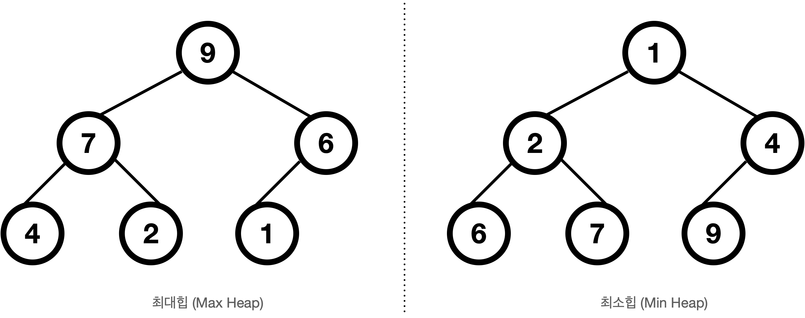
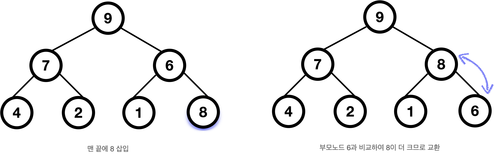
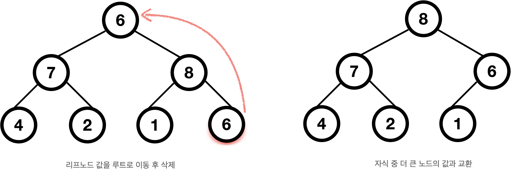

# Heap
우선순위 큐의 구현을 가장 효율적으로 할 수 있는 구조
## heap의 개념
* heap: 사전에서는 더미, **완전이진트리** 기반 더미와 비슷한 모습이기 때문에
* 여러 값들 중 가장 값이 크거나 가장 값이 작은 값을 빠르게 찾을 수 있음
* 힙은 느슨한 정렬 상태를 유지한다. (큰 값이 상위에 작은 값이 하위에)
* 왼쪽 자식 인덱스 = (부모의 인덱스) * 2  
  오른쪽 자식의 인덱스 = (부모의 인덱스) * 2 + 1
### 힙의 종류
* 최대 힙  
부모노드 값이 자식노드 값보다 크거나 같은 완전 이진 트리
* 최소 힙  
부모노드 값이 자식노드 값보다 작거나 같은 완전 이진 트리
</br>  

## heap 구현 (최대힙 기준)
* 삽입 과정  
  맨 끝에 삽입한 후 부모노드보다 큰 경우, 부모와 위치 변경
</br>  
```cpp
void insert(int heap[], int n, int val){
    heap[n] = val;
    int i = n++;

    while(i != 0 && val > heap[i/2]){
        heap[i] = heap[i/2];
        i /= 2;
    }
    heap[i] = val;
}
```  

* 삭제 과정  
  맨 끝의 노드를 루트로 옮긴 후 삭제, 루트의 자식 중 큰 값과 값 교환  
</br>  
```cpp
void delete(int heap[], int n){
    int parent = 0, child = 1;
    int tmp = heap[--n];

    while( heap[child] <= heap.size()-1 ){
        if( child < heap.size()-1 && heap[child] < heap[child+1])
            child++;
        if( tmp >= heap[child] )
            break;
        heap[parent] = heap[child];
        parent = child;
        i *= 2;
    }
    heap[parent] = tmp;
}
```
* heapify : 일반 배열을 heap화 하는 과정  
루트가 자식보다 작으면 계속 교환하며, 교환할 값이 없을 때까지 반복  
아래 코드는 루트가 i인 서브트리를 최대힙화  
```cpp
void heapify(int arr[], int n, int i){
    // 일단 i를 largest로, 자식들 인덱스 설정
    int largest = i;
    int l = 2 * i;
    int r = 2 * i + 1;

    //l, r 중 루트보다 큰 값이 있으면 largest 바꿈
    if(l < n && arr[l] > arr[largest])
        largest = l;
    if(r < n && arr[r] > arr[largest])
        largest = r;
    // largsest가 루트가 아니면 다시 heapify
    if(largest != i){
        swap(arr[i], arr[largest]);
        heapify(arr, int n, int largest);
    }
}
```

## heap의 복잡도
heap트리의 높이: logN  
- 삭제: O(logN)
- 삽입: O(logN)
- heapify: O(NlogN)

## heap정렬
  * 내림차순 정렬 --> 최대힙
  * 오름차순 정렬 --> 최소힙
  * heap정렬의 시간복잡도: O(NlogN)  
    최악/최고의 경우 모두 O(NlogN)