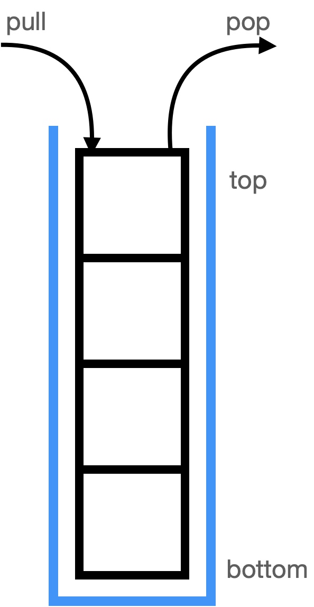
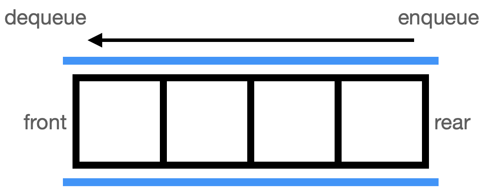
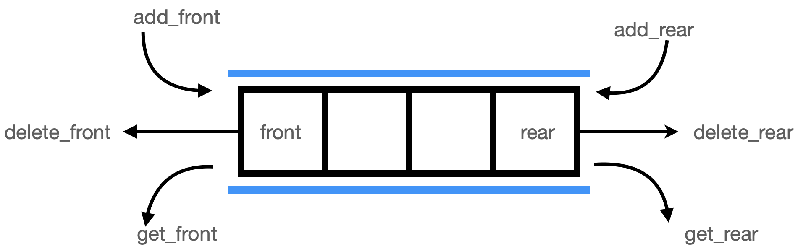

# Stack And Queue

## Stack
   
* 후입선출 (LIFO: Last In First Out)의 선형 자료구조
### 기본적인 연산
  * is_full: 스택이 다 차있는지
  * is_empty: 스택이 비어있는지
  * pop: 스택의 top 요소를 반환하면서 삭제
  * pull: 원소를 스택의 top에 추가
  * peek: 스택의 top 요소를 반환
### 시공간복잡도
  * 시간복잡도
    * pull: O(1)
    * pop: O(1)
    * Search: O(n)
  * 공간복잡도: O(n)
### 사용되는 알고리즘 문제
  * 괄호 검사 (대표 문제: https://www.acmicpc.net/problem/2504)
  * 수식의 계산 (대표 문제: https://www.acmicpc.net/problem/1918)
  * 미로 탐색 DFS (대표 문제: https://www.acmicpc.net/problem/2178)
### 스택의 사용 사례
  * 재귀 알고리즘
  * 웹 브라우저 방문기록 (뒤로가기 할때)
  * 실행 취소
  * 문자열 역순으로 만들기
  * 콜스택

## Queue
   
* 선입선출 (FIFO: First In First Out)의 선형 자료구조
### 기본적인 연산
  * is_full: 큐가 다 차있는지
  * is_empty: 큐가 비어있는지
  * enqueue: 큐의 front 요소를 반환하고 삭제
  * dequeue: 원소를 queue의 rear에 밀어넣음
  * peek: 큐의 front 요소를 반환
### 시공간복잡도
  * 시간복잡도
    * enqueue: O(1)
    * dequeue: O(1)
    * Search: O(n)
  * 공간복잡도: O(n)
### 사용되는 알고리즘 문제
  * 시뮬레이션 (대표 문제: https://www.acmicpc.net/problem/3190)
  * 미로 탐색 BFS (대표 문제: https://www.acmicpc.net/problem/2178)
### 큐의 사용 사례
  * 버퍼
  * BFS
  * 프로세스 관리
  * 출력처리

## deque
   
* double-ended queue 전단과 후단에서 삽입/삭제가 가능한 큐
* 입력제한 덱 (Input restricted deque, scroll) : 데이터 삽입이 한쪽에서만 가능  
  출력제한 덱 (Output restricted deque, shelf) : 데이터 삭제가 한쪽에서만 가능
### 사용되는 알고리즘 문제: 탐색
### 활용사례
  * 앞뒤 삽입삭제가 자주 일어나는 경우
  * 데이터 개수가 가변적인 경우
  * 데이터 검색을 거의 하지 않는 경우

## priority queue
* 우선순위가 가장 높은 데이터를 가장 먼저 삭제하는 자료구조
### 구현 방법
  * 리스트로 구현 --> 데이터 삽입/삭제할때 비용이 큼
  * 연결리스트로 구현 --> 노드 연결을 거쳐 접근하며 비교해야 해서 비용이 큼
  * 힙으로 구현 --> 보편적