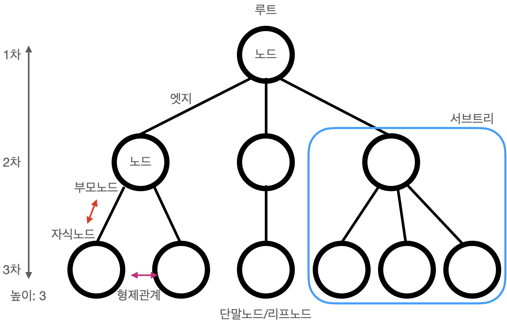

# Tree
- 계층적 구조(hierarchical structure)의 자료구조  
- 사용예: 디렉터리 구조, 인공지능 결정트리(decision tree)  
  계층적 관계를 표현할 때 사용된다.
- 일반적인 경우에 요소를 찾는데 O(logN)으로 탐색이 가능하다.  

## tree 구성요소
</br>  
- node: 트리의 각각의 요소
- edge: 노드와 노드를 연결하는 간선
- root: 트리 최상위의 노드
- terminal node / leaf node: 자식노드가 없는 노드
- level: 트리 각층에 번호를 매김
- height: 트리가 가지고 있는 최대 레벨

---
## 이진트리
* 모든 노드가 2개의 서브트리를 가지고 있는 트리  
  서브트리는 공집합일수 있다

### 이진트리의 성질
* n개의 노드를 가지면 n-1개의 간선을 가진다.  
* 이진트리의 높이가 h일때, 최소 노드 개수는 h개  
  최대 노드 개수는 2^(i-1)개

### 이진트리의 분류
* 포화이진트리, Full Binary Tree: 모든 레벨이 꽉찬 이진트리  
  높이가 k이면 2^k-1의 노드를 가진다.  
* 완전이진트리, Complete Binary Tree: 왼쪽에서 오른쪽 순서로 차곡차곡 채워진 이진트리   
  포화이진트리는 완전이진트리이지만 그 역은 항상 성립하지 않는다.
* 편향이진트리, Skewed Binary Tree: 어느 한쪽으로 편향되어 있는 이진트리

### 이진트리 표현법
* 배열표현법
  * 노드 i의 부모노드 인덱스: i/2
  * 노드 i의 왼쪽 자식노드 인덱스: i*2
  * 노드 i의 오른쪽 자식노드 인덱스: i*2 + 1
* 링크표현법
  * 링크로 왼쪽 자식노드, 오른쪽 자식노드 주소를 저장
  ```
  typedef structure TreeNode{
      int data;
      struct TreeNode *left, *right;
  }
  ```

### 이진트리 순회방법
이 방법으로 수식 표현 가능
* 전위순회 - 부모, 왼쪽 서브트리, 오른쪽 서브트리
* 중위순회 - 왼쪽 서브트리, 부모, 오른쪽 서브트리
* 후위순회 - 왼쪽 서브트리, 오른쪽 서브트리, 부모