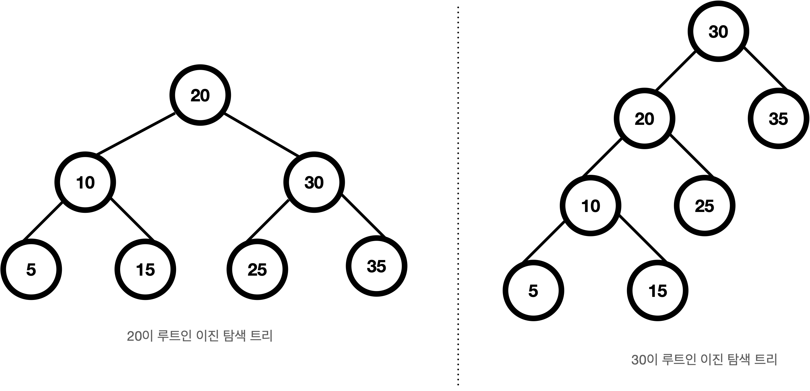
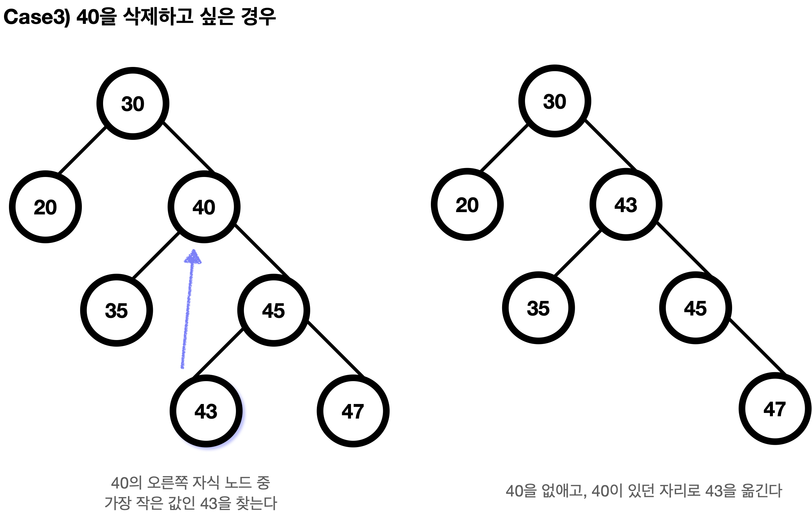

# 이진 탐색 트리  
### 이진 탐색 트리의 특징  
- 각 노드는 키 값을 하나씩 갖고, 각 노드의 키 값은 모두 달라야 한다.  
- 최상위 레벨에는 루트노드가 있고, 각 노드는 최대 두개의 자식노드를 갖는다.(이진트리)  
- 임의의 노드의 키 값은 자신의 왼쪽에 있는 모든 노드 키 값보다 크고, 오른쪽에 있는 모든 노드 키 값보다 작다.  
  
  
  
### 이진 탐색 트리에서 검색  
* 키가 x인 노드를 검색  
  - x와 현재 탐색중인 노드의 키를 비교하여 x가 작은 경우, 왼쪽 서브 트리 탐색  
  - x와 현재 탐색중인 노드의 키를 비교하여 x가 큰 경우, 오른쪽 서브 트리 탐색  
#### 탐색 pseudo code  
``` c
// t: 트리의 루트노드
// x: 탐색하고자 하는 키
binarySearchTree(t, x) {
    if (t == NULL or t->key == x)
        return t;
    else if (t->key < x)
        binarySearchTree(t->left, x);
    else
        binarySearchTree(t->right, x);
}
```

### 이진 탐색 트리에서 삽입  
* 키가 x인 노드를 삽입  
  - x를 검색한 후, 없는 경우 삽입 시작  
  - x와 현재 탐색 중인 노드의 키를 비교하여 x가 작은 경우, 왼쪽으로 이동  
  - x와 현재 탐색 중인 노드의 키를 비교하여 x가 큰 경우, 오른쪽으로 이동  
  - 리프노드에 다다르면 비교하여 x의 키 값이 작은경우 왼쪽에, 큰 경우 오른쪽에 삽입  
* 삽입 시에 정렬된 순서로 삽입하는 경우 균형이 맞지않는 트리가 만들어짐  
 → 검색 효율이 떨어짐
  - 최악의 경우 검색 시간 복잡도: O(N)
  - 최선의 경우 검색 시간 복잡도: O(logN)
</br>  

### 이진 탐색 트리에서 삭제  
* 삭제하는 세가지 경우  
  - Case1: r이 리프노드인 경우  
  → r을 버린다  
  - Case2: r의 자식 노드가 한개인 경우   
  → r의 부모가 r의 자식을 직접 가리키도록 한다  
  - Case3: r의 자식 노드가 두개인 경우  
  → r의 오른쪽 서브 트리의 최소 원소 노드 s를 삭제하고, s를 r자리에 놓는다  
